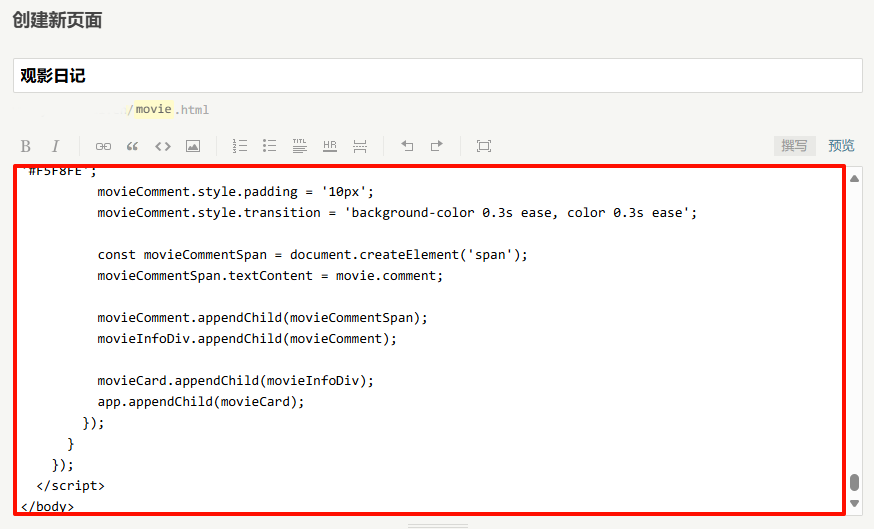

# 豆瓣个人影评提取

## 前言

最近有一个需求，想给博客写一个「观影日记」页面，因为我平时比较喜欢用豆瓣对电影进行评分，所以想把该页面对接豆瓣的接口，但是经过一番查找，发现豆瓣前两年就取消了对接口使用的申请，因此我想换一种思路实现相同的效果。

## 效果预览

在线预览：[观影日记 - Kito's Blog](https://www.yangzirui.cn/movie.html)

截图预览：

## 具体实现

1. 打开豆瓣「我看过的影视」界面

2. 用浏览器开发者工具监听**网络请求**，发现豆瓣直接从服务端返回了一整个页面

   

3. 使用 Axios 发请求拿到该 html 文档，用**正则表达式**提取出所需的信息（标题、封面、上映日期、时长、星级评价、文字评价）

4. 其中，星级评价豆瓣是通过精灵图实现的，因此，需要把精灵图拿出来，修改背景图片位置来实现星级展示

5. 渲染到页面中，并用**媒体查询**完成响应式

如果只想当作一个独立页面使用，那么完成以上就够了，代码我使用了 Vue 进行编写，放在了 `./vue` 文件夹中

**以下步骤是为了能够正确显示到博客中：**

6. 打开博客页面的开发者工具，观察切换深色模式时，哪个类名发生了改变，发现在 Typecho 系统下，是 `data-color` 的值变为了 `dark-color`
7. 监听该值的变化，深色模式下，修改对应样式
8. 由于博客系统中的独立页面是用 md 编辑器发布的，因此，我们需要将 Vue 代码转换为原生代码，并**转换为行内式**（否则在 md 编辑器的转译下，该原生代码不会进行渲染）

## 遇到的问题

1. 跨域问题

   豆瓣没有设置允许跨域的访问头，因此会出现跨域问题导致无法正常获取内容

   因为最终要转为原生形式显示在博客中，所以我使用了第三方 CORS 代理服务（实际上你也可以通过修改 Vite 配置达到一样的效果）

2. 防盗链问题

   豆瓣的图片可能设置了防盗链机制，禁止其他网站直接引用其图片资源，所以封面无法显示

   所以我使用了代理服务器来转发图片请求，绕过防盗链的机制

## 如何在博客中使用

> [!TIP]
> 深色模式仅支持 Typecho 博客系统，如果你用的是其他博客系统，可以联系我（QQ7596833），我帮你适配（免费）。

1.  将 `./blog-movie-page/movie.html` 中的 ID 部分替换为你的豆瓣 ID

   按 Ctrl + F 搜索 `collect` 可快速定位

   

   > 如何查看 ID？用电脑登录豆瓣，访问个人主页，ID 就在浏览器地址栏

2. 全选、复制、粘贴，在博客后台以文章或独立页面的形式发布即可

   

